# Fun with MNIST
All MNIST images are padded to 32 * 32 for the sake of convenience. The MNIST data is already downloaded in the `./data` directory.
## Table of contents
- Basics
    - MNIST Classification
    - PCA: Principle Component Analysis on MNIST
    - tSNE: t-Nearest Neighbors Embedding on MNIST

- Generative Models

|Model|Reference|Difference from orignal GAN|
|-----|---------|---|
|**Autoencoders**|
|Vanilla Autoencoders|https://www.cs.toronto.edu/~hinton/science.pdf|N/A|
|VAE: Variational Autoencoders|https://arxiv.org/abs/1312.6114|N/A|
|**GANs**|
|GAN: Generative Adversarial Networks|https://arxiv.org/abs/1406.2661|N/A|
|Adversarial Autoencoders|https://arxiv.org/abs/1511.05644|Encoder generates samples from a prior distribution.|
|WGAN: Wasserstein's GAN|https://arxiv.org/abs/1701.07875|No sigmoid at discriminator output, weight clipping.|
|WGAN-GP: Improved Wasserstein's GAN|https://arxiv.org/abs/1704.00028|Same as WGAN but replaces weight clipping with gradient penalty.|
|InfoGAN: Information maximizing GAN|https://arxiv.org/abs/1606.03657||
|ACGAN: Auxiliary Classifier GAN|https://arxiv.org/abs/1610.09585|Generator has label information, discriminator also classifies.|
|Conditional GAN|https://arxiv.org/abs/1411.1784|Both generator and discriminator has label information|
|VAE-GAN: VAE + GAN|https://arxiv.org/abs/1512.09300|
|BEGAN: Boundary Equilibrium GAN|https://arxiv.org/abs/1703.10717||
|EBGAN: Energy-based GAN|https://arxiv.org/abs/1609.03126|Models discriminator as an autoencoder|
|LSGAN: Least Squares GAN|https://arxiv.org/abs/1611.04076|No sigmoid at discriminator output, measures L2 distance of image scores.|

- Domain Adaptation

|Model|Reference|
|-----|---------|
|CycleGAN|https://arxiv.org/abs/1703.10593|
|Coupled GAN|https://arxiv.org/abs/1606.07536|
|UNIT|https://arxiv.org/abs/1703.00848|
|pix2pix|https://arxiv.org/abs/1611.07004|

- Others

|Topic|Reference|
|-----|---------|
|Semi-supervied learning with SGAN|https://arxiv.org/abs/1606.01583|
|Transfer Learning||
|Spatial Transformer Networks||

## Basics
### MNIST Classification
Back to the basics: implemeting a CNN to classify digits. The architecture is a feature extrator(convolutional layers) + a fully connected layer that outputs class probabilities.
```
CONV(in:1, out:64, k4s2)->LeakyReLU(0.2)->BN(64)->
CONV(in:64, out:128, k4s2)->LeakyReLU(0.2)->BN(128)->
CONV(in:128, out:256, k4s2)->LeakyReLU(0.2)->BN(256)->
CONV(in:256, out:512, k4s2)->LeakyReLU(0.2)->BN(512)->
FCN(2048, 10)->Softmax
```

#### Results
|Accuracy|Notes|
|--------|-----|
|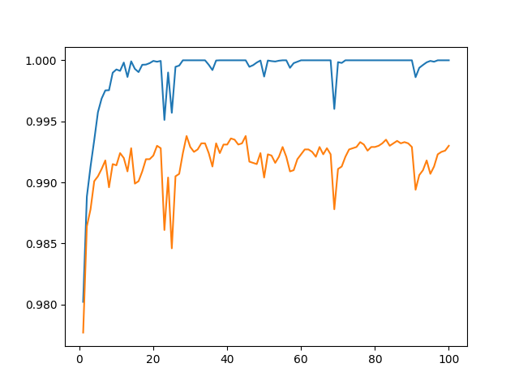|blue: train, orange: test|

### PCA on MNIST
|PCA|
|---|
|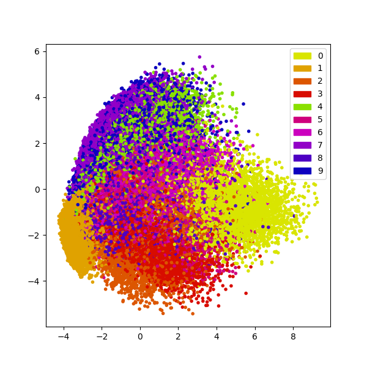|

### tSNE on MNIST
|tSNE|
|----|
|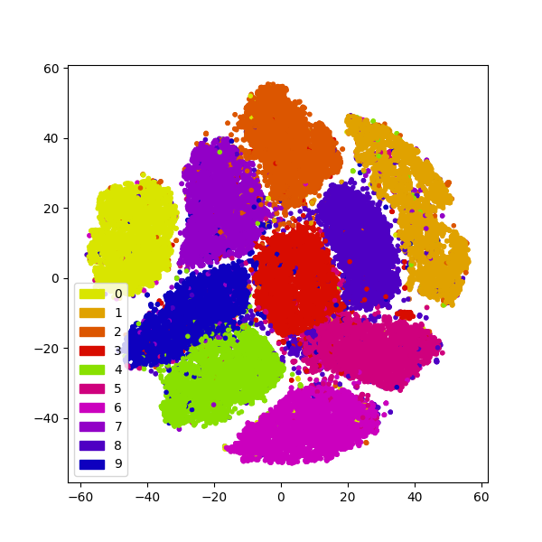

## Generative Models
In the following generative models, some of them (all GANs) are modified from the following model architecture (DCGAN-like):
- Downsampling networks(discriminator, encoders)
```python
nn.Sequential(
                nn.Conv2d(1, 64, 4, 2, 1, bias = False),
                nn.LeakyReLU(0.2),
                nn.Conv2d(64, 128, 4, 2, 1, bias = False),
                nn.BatchNorm2d(128),
                nn.LeakyReLU(0.2),
                nn.Conv2d(128, 256, 4, 2, 1, bias = False),
                nn.BatchNorm2d(256),
                nn.LeakyReLU(0.2),
                nn.Conv2d(256, 512, 4, 2, 1, bias = False),
                nn.BatchNorm2d(512),
                nn.LeakyReLU(0.2),
                nn.Conv2d(512, self.latent_dim, 2, 1),
                nn.Sigmoid()
                )
```
- Upsampling networks(generator, decoder)
```python
nn.Sequential(
                nn.ConvTranspose2d(self.latent_dim, 512, 4, 2, 1, bias = False),
                nn.BatchNorm2d(512),
                nn.ReLU(),
                nn.ConvTranspose2d(512, 256, 4, 2, 1, bias = False),
                nn.BatchNorm2d(256),
                nn.ReLU(),
                nn.ConvTranspose2d(256, 128, 4, 2, 1, bias = False),
                nn.BatchNorm2d(128),
                nn.ReLU(),
                nn.ConvTranspose2d(128, 64, 4, 2, 1, bias = False),
                nn.BatchNorm2d(64),
                nn.ReLU(),
                nn.ConvTranspose2d(64, 1, 4, 2, 1, bias = False),
                nn.Sigmoid()
                )
```
Some models (eg. autoencoders, vae) are just simple fully-connected layers. I did not replicate all settings in the orignal papers since it is more important to capture the overall concept.

***
***
### **[ Deep autoencoders ]**
Autoencoders are relatively simple generative models compared to the state-of-the-art GANs. The basic idea is to project a high-dimensional vector (eg. an image) to a low-dimensional latent space, and then reconstruct the image based on this latent code representation.
#### Structure


#### Results
Reconstruction from 100 dimension latent code.  

|Original|Reconstructed|
| ------ | ------------|
||

After 50 epochs, images can almost be perfectly reconstructed.
***
Reconstruction from 2 dimension latent code. (last layer of the encoder with **sigmoid**, hence the code value is clipped between 0 and 1).  

|Original|Reconstructed|
| ------ | ------------|
|||

The results are blurry since images are reconstructed from 2-dimensional codes, where the original images are 32 * 32 = 1024 dimensional vectors. Much information is lost after encoding process.
***
We can also generate images on the 2-dimensional manifold. From the results below, we can see that there seems to be some correlation between the digit shapes and the dimenions.  

|(0,1) range for both dimensions|Random Generation|
|--------|-------|
|||

Scatter plot for the 2-dimension manifold is seen below. Note that code of the same digits tend to cluster in the latent space.  

|Plot|
|----|
||

***
Below are the resonctruction results after 50 epochs with the sigmoid activation removed from the encoder.

|Original|Reconstructed|
| ------ | ------------|
|||

Scatter plot of the 2D manifold.  

|Plot|
|----|
||
***
After adding L2 regularization of the latent codes to the loss (weight = 0.2), we can see the codes are restricted around to a small region.

|Original|Reconstructed|
| ------ | ------------|
|||

Scatter plot of the 2D manifold.  

|Plot|
|----|
||
***
***
### **[ VAE: Variational Autoencoder ]**
Unlike autoencoders, VAE encoders output two vectors, **mean** and **sigma**. We then sample from the normal distribution characterized by mean and sigma (let this distribution be *Q*), and take this as the decoder input.

#### Structure


In my experiment, a simple fully connected network is used.
```
 784 -> 400 -> (mu: 2, logvar: 2) -> 2 -> 400 -> 784
```
The numbers indicates the size of the hidden layer.

#### Objective
Usually the decoder input is sampled from a N(0,1) normal distribution. We can simply add a **KL divergence** loss between *N, Q* to the original autoencoder reconstruction loss so as to match *Q* with the desired *N* distribution.


#### Results
|Original|Reconstructed|Random Generation|
| ------ | ------------|--------|
|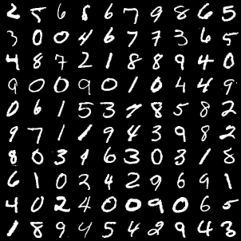||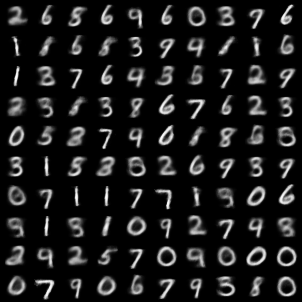|

By sampling from uniform(0, 1) and transfroming it to Gaussian through Box-Muller method, we can visualize the 2-D continuous manifold.

|Manifold|
|--------|
|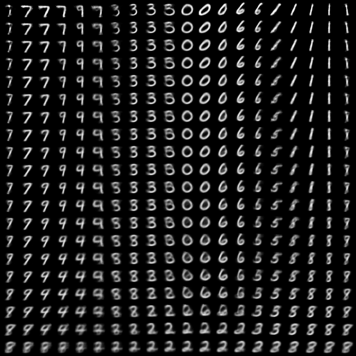|

***
***
### **[ GAN: Generative Adversarial Networks ]**
The groundwork for most generative models today, GANs are generally composed of two actors, a Generator and a Discriminator, who play a zero-sum game. The discriminator tries to distinguish real and synthesized images, while the generator learns to create images that fool the discriminator.
#### Structure


#### Algorithm


#### Results
|Real images|Generated|
| ------ | ------------|
|||
***
***
### **[ Adversarial Autoencoders ]**
Similar to VAE(Variational Autoencoders), the encoder in Adversairal Autoencoders (AAE) also learns to fit a given prior distribution, but by fooling a distribution discriminator rather tha n minimizing the KL divergence. 

#### Structure
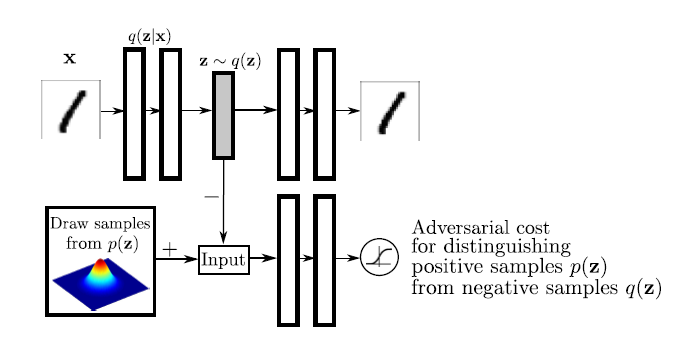

The discriminator tries to determine if the input is from a prior distribution *p(z)* or is generated by the decoder.  

I simply employed the fully connected network setting in the original paper. The output for the encoder network is linear activation since many distributions has infinite range.

#### Results
The encoder tries to fit a "triangle" and "donut" distribution. The results below show that the shape of the distribution is captured by the encoder.

|Original|Reconstructed|Manifold|
| ------ | ------------|--------|
|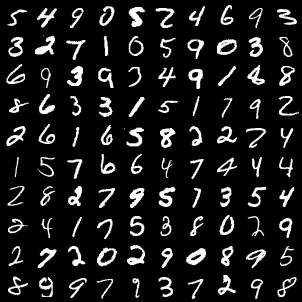||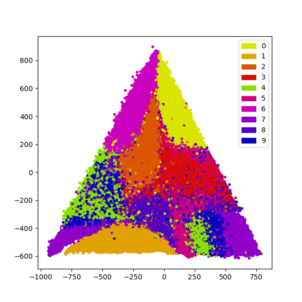|
|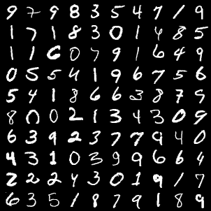||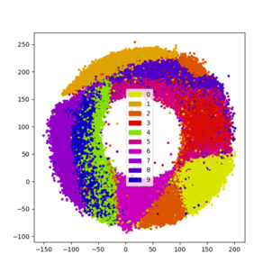|

***
***

### **[ WGAN: Wasserstein's GAN ]**
An (allegedly) more stable GAN model. Rather than minimizing the JS divergence between the prior training dats distribution and the generated data distribution as in GAN, WGAN minimizes the **Wasserstein's** distance. 
#### Algorithm

#### Results
|Real images|Generated|
| ------ | ------------|
|||

***
***
### **[ WGAN-GP: WGAN with Gradient Penalty ]**
In WGAN, it is difficult to enforce the Lipschitz constraint. The original paper suggests clipping weights, but bad choices of the bounds may lead to failures. WGANGP resolves this problem by using gradient penalty to enforce the Lipshitz constraint.

#### Algorithm
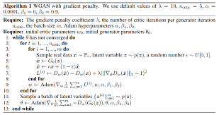

#### Results
|Real images|Generated|
| ------ | ------------|
|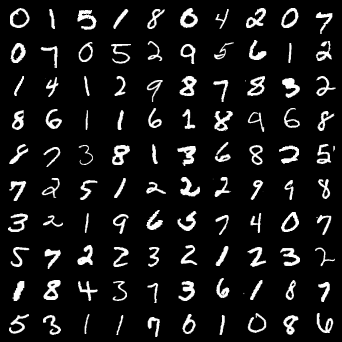|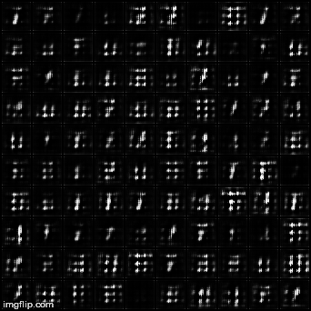|

***
***
### **[ LSGAN: Least Squares GAN ]**
Yet another GAN variant with a modified loss function. Sigmoid activation is removed from the output layer of the discriminator, and we aim to minimize the **L2** distance between the discriminator outputs and the wished score for each image.

#### Objective 
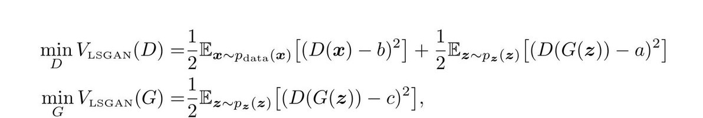

*a, b, c* are hyperparameters to be determined (the scores we want fake and real images to have). In the original paper, the author uses *a = 1, b = 0, c = 1*.

#### Results
|Real images|Generated|
| ------ | ------------|
|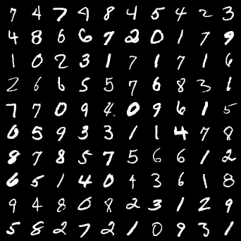|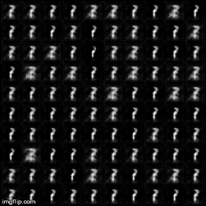|
***
***

### **[ ACGAN: Auxiliary Classifier GANs ]**
In ACGAN, the discriminator not only learns to distinguish fake and real images, but also tries to classify the image into correct labels. We can then manipulate the disentangled latent code and generate images conditioned on their class.

#### Structure


The class information is usually representated by a one-hot encoding. It is then concatenated with a noise vector and fed to the generator.

#### Objective


#### Results
|Fixing noise|Generated|
| ------ | ------------|
|||

When we fix the noise vector and only change the class label vector, ACGAN generates images from different classes but similar overall structure (eg. thickness, tilt, rotation...).
***
***

### **[ Conditional GAN ]**
By simply providing extra information (eg. class labels) to both the discriminator and generator, we can extend the original GAN model to a conditional setting. That is, the generator would be able to perform conditional generation.

#### Struture
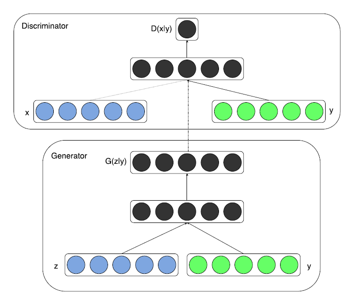

The conditional information can come in many forms. For simple multi-class labels, usually we just feed the networks with one-hot encodings. For more complex conditions such as text, we can train a better embedding (eg. word2vec), and the embedded code will be our condition.

#### Objective
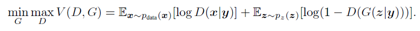

Note that the loss is nearly identical to the original GAN loss, only that it is conditioned on some prior knowledge *y*.

#### Results
|Real|Generated|
| ------ | ------------|
|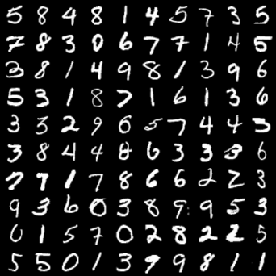|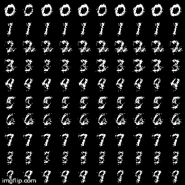|