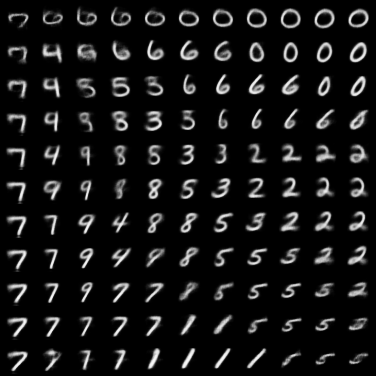
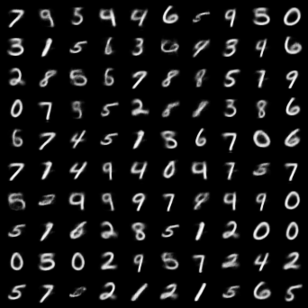

# Fun with MNIST
All MNIST images are padded to 32 * 32 for the sake of convenience. The MNIST data is already downloaded in the `./data` directory.
## Table of contents
- Basics
    - MNIST Classification
    - tSNE on MNIST
    - PCA on MNIST

- Generative Models
    - Vanilla Autoencoders
    - VAE: Variational Autoencoder
    - GAN: Generative Adversarial Networks
    - WGAN: Wasserstein's GAN
    - WGAN-GP: Improved Wasserstein's GAN
    - InfoGAN: Information maximizing GAN
    - ACGAN: Auxiliary Classifier GAN
    - Conditional GAN
- Transfer Learning

## Generative Models
In the following generative models, almost all of them are modified from the following model architecture:
```python
// Example: Autoencoder structure
// Downsampling network (eg. Encoder, Discriminator)
nn.Sequential(
                nn.Conv2d(1, 64, 4, 2, 1, bias = False),
                nn.LeakyReLU(0.2),
                nn.Conv2d(64, 128, 4, 2, 1, bias = False),
                nn.BatchNorm2d(128),
                nn.LeakyReLU(0.2),
                nn.Conv2d(128, 256, 4, 2, 1, bias = False),
                nn.BatchNorm2d(256),
                nn.LeakyReLU(0.2),
                nn.Conv2d(256, 512, 4, 2, 1, bias = False),
                nn.BatchNorm2d(512),
                nn.LeakyReLU(0.2),
                nn.Conv2d(512, self.latent_dim, 2, 1),
                nn.Sigmoid()
                )
                
// Upsampling network (eg. Decoder, Generator)
nn.Sequential(
                nn.ConvTranspose2d(self.latent_dim, 512, 4, 2, 1, bias = False),
                nn.BatchNorm2d(512),
                nn.ReLU(),
                nn.ConvTranspose2d(512, 256, 4, 2, 1, bias = False),
                nn.BatchNorm2d(256),
                nn.ReLU(),
                nn.ConvTranspose2d(256, 128, 4, 2, 1, bias = False),
                nn.BatchNorm2d(128),
                nn.ReLU(),
                nn.ConvTranspose2d(128, 64, 4, 2, 1, bias = False),
                nn.BatchNorm2d(64),
                nn.ReLU(),
                nn.ConvTranspose2d(64, 1, 4, 2, 1, bias = False),
                nn.Sigmoid()
                )
```
Simple modifications or addition can be applied to the above templates to create different generative models. For example, in DCGAN generators, usually we apply a `Tanh` activation function at the output layer. 
### Deep autoencoders
Autoencoders are relatively simple generative models compared to the state-of-the-art GANs. The basic idea is to project a high-dimensional vector (eg. an image) to a low-dimensional latent space, and then reconstruct the image based on this latent code representation.
#### Settings
For comparison, I trained two autoencoders: one reconstructs images from 2-dimensional latent codes, the other from 100-dimensional latent codes. All models uses **Adam** optimizer with **betas = (0.5, 0.999), learning rate = 0.0002**.
#### Results
Reconstruction from 100 dimension latent code.  

|Original|Reconstructed|
| ------ | ------------|
||

After 50 epochs, images can almost be perfectly reconstructed.
***
Reconstruction from 2 dimension latent code.  

|Original|Reconstructed|
| ------ | ------------|
|||

The results are blurry since images are reconstructed from 2-dimensional codes, where the original images are 32 * 32 = 1024 dimensional vectors. Much information is lost after encoding process.
***
We can also generate images on the 2-dimensional manifold. From the results below, we can see that there seems to be some correlation between the digit shapes and the dimenions.  

|(0,1) range for both dimensions|Random Generation|
|--------|-------|
|||


