# Fun with MNIST
All MNIST images are padded to 32 * 32 for the sake of convenience. The MNIST data is already downloaded in the `./data` directory.
## Table of contents
- Basics
    - MNIST Classification
    - tSNE on MNIST
    - PCA on MNIST

- Generative Models

|Model|Reference|
|-----|---------|
|Vanilla Autoencoders|https://www.cs.toronto.edu/~hinton/science.pdf|
|VAE: Variational Autoencoder|https://arxiv.org/abs/1312.6114|
|GAN: Generative Adversarial Networks|https://arxiv.org/abs/1406.2661|
|Adversarial Autoencoders|https://arxiv.org/abs/1511.05644|
|WGAN: Wasserstein's GAN|https://arxiv.org/abs/1701.07875|
|WGAN-GP: Improved Wasserstein's GAN|https://arxiv.org/abs/1704.00028|
|InfoGAN: Information maximizing GAN|https://arxiv.org/abs/1606.03657|
|ACGAN: Auxiliary Classifier GAN|https://arxiv.org/abs/1610.09585|
|Conditional GAN|https://arxiv.org/abs/1411.1784|
|VAE-GAN: VAE + GAN|https://arxiv.org/abs/1512.09300|
|BEGAN: Boundary Equilibrium GAN|https://arxiv.org/abs/1703.10717|
|EBGAN: Energy-based GAN|https://arxiv.org/abs/1609.03126|
|LSGAN: Least Squares GAN|https://arxiv.org/abs/1611.04076|

- Others

|Topic|Reference|
|-----|---------|
|Semi-supervied learning with SGAN|https://arxiv.org/abs/1606.01583|
|Transfer Learning||

## Generative Models
In the following generative models, almost all of them are modified from the following model architecture:
```python
// Example: Autoencoder structure
// Downsampling network (eg. Encoder, Discriminator)
nn.Sequential(
                nn.Conv2d(1, 64, 4, 2, 1, bias = False),
                nn.LeakyReLU(0.2),
                nn.Conv2d(64, 128, 4, 2, 1, bias = False),
                nn.BatchNorm2d(128),
                nn.LeakyReLU(0.2),
                nn.Conv2d(128, 256, 4, 2, 1, bias = False),
                nn.BatchNorm2d(256),
                nn.LeakyReLU(0.2),
                nn.Conv2d(256, 512, 4, 2, 1, bias = False),
                nn.BatchNorm2d(512),
                nn.LeakyReLU(0.2),
                nn.Conv2d(512, self.latent_dim, 2, 1),
                nn.Sigmoid()
                )
                
// Upsampling network (eg. Decoder, Generator)
nn.Sequential(
                nn.ConvTranspose2d(self.latent_dim, 512, 4, 2, 1, bias = False),
                nn.BatchNorm2d(512),
                nn.ReLU(),
                nn.ConvTranspose2d(512, 256, 4, 2, 1, bias = False),
                nn.BatchNorm2d(256),
                nn.ReLU(),
                nn.ConvTranspose2d(256, 128, 4, 2, 1, bias = False),
                nn.BatchNorm2d(128),
                nn.ReLU(),
                nn.ConvTranspose2d(128, 64, 4, 2, 1, bias = False),
                nn.BatchNorm2d(64),
                nn.ReLU(),
                nn.ConvTranspose2d(64, 1, 4, 2, 1, bias = False),
                nn.Sigmoid()
                )
```
Simple modifications or addition can be applied to the above templates to create different generative models. For example, in DCGAN generators, usually we apply a `Tanh` activation function at the output layer.  

You can also try simple fully-connected networks and compare the performance with CNN-based models.
### Deep autoencoders
Autoencoders are relatively simple generative models compared to the state-of-the-art GANs. The basic idea is to project a high-dimensional vector (eg. an image) to a low-dimensional latent space, and then reconstruct the image based on this latent code representation.
#### Structure

#### Settings
For comparison, I trained two autoencoders: one reconstructs images from 2-dimensional latent codes, the other from 100-dimensional latent codes. All models uses **Adam** optimizer with **betas = (0.5, 0.999), learning rate = 0.0002**.
#### Results
Reconstruction from 100 dimension latent code.  

|Original|Reconstructed|
| ------ | ------------|
||

After 50 epochs, images can almost be perfectly reconstructed.
***
Reconstruction from 2 dimension latent code. (last layer of the encoder with **sigmoid**, hence the code value is clipped between 0 and 1).  

|Original|Reconstructed|
| ------ | ------------|
|||

The results are blurry since images are reconstructed from 2-dimensional codes, where the original images are 32 * 32 = 1024 dimensional vectors. Much information is lost after encoding process.
***
We can also generate images on the 2-dimensional manifold. From the results below, we can see that there seems to be some correlation between the digit shapes and the dimenions.  

|(0,1) range for both dimensions|Random Generation|
|--------|-------|
|||

Scatter plot for the 2-dimension manifold is seen below. Note that code of the same digits tend to cluster in the latent space.  

|Plot|
|----|
||

***
Below are the resonctruction results after 50 epochs with the sigmoid activation removed from the encoder.

|Original|Reconstructed|
| ------ | ------------|
||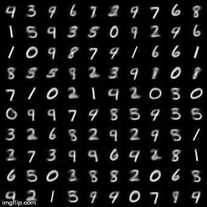|

Scatter plot of the 2D manifold.  

|Plot|
|----|
||
***
After adding L2 regularization of the latent codes to the loss (weight = 0.2), we can see the codes are restricted around to a small region.

|Original|Reconstructed|
| ------ | ------------|
||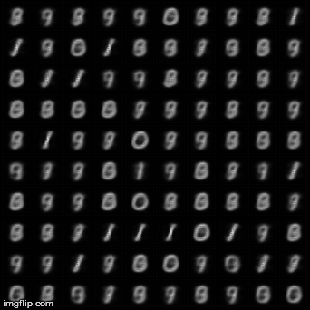|

Scatter plot of the 2D manifold.  

|Plot|
|----|
||
***
***
### VAE: Variational Autoencoder
Unlike autoencoders, VAE encoders output two vectors, **mean** and **sigma**. We then sample from the normal distribution characterized by mean and sigma (let this distribution be *Q*), and take this as the decoder input.

#### Structure


#### Loss design
Usually the decoder input is sampled from a N(0,1) normal distribution. We can simply add a **KL divergence** loss between *N, Q* to the original autoencoder reconstruction loss so as to match *Q* with the desired *N* distribution.

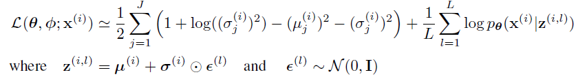
#### Results
***
***
### GAN: Generative Adversarial Networks
The groundwork for most generative models today, GANs are generally composed of two actors, a Generator and a Discriminator, who play a zero-sum game. The discriminator tries to distinguish real and synthesized images, while the generator learns to create images that fool the discriminator.
#### Structure
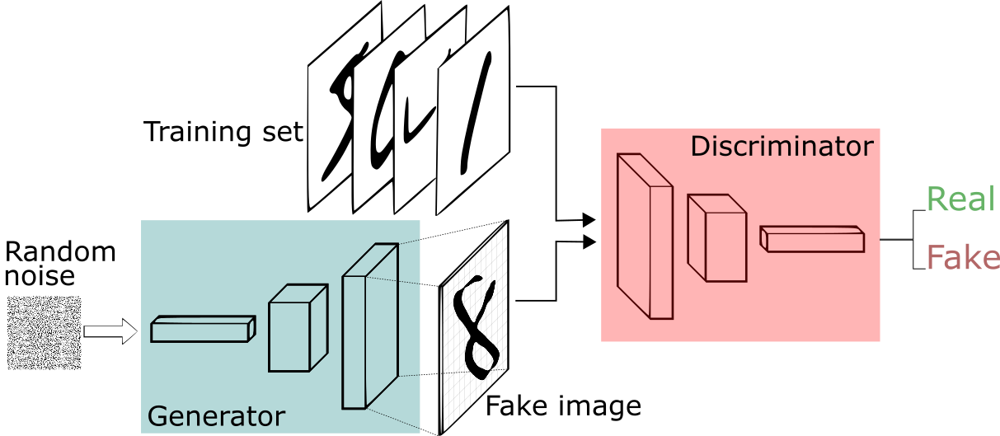
#### Algorithm

#### Results
|Real images|Generated|
| ------ | ------------|
|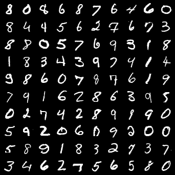|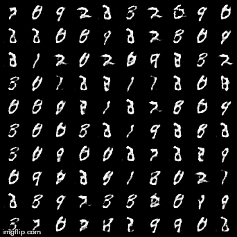|
***
***
### WGAN: Wasserstein's GAN
An (allegedly) more stable GAN model. Rather than minimizing the JS divergence between the prior training dats distribution and the generated data distribution as in GAN, WGAN minimizes the **Wasserstein's** distance. 
#### Algorithm
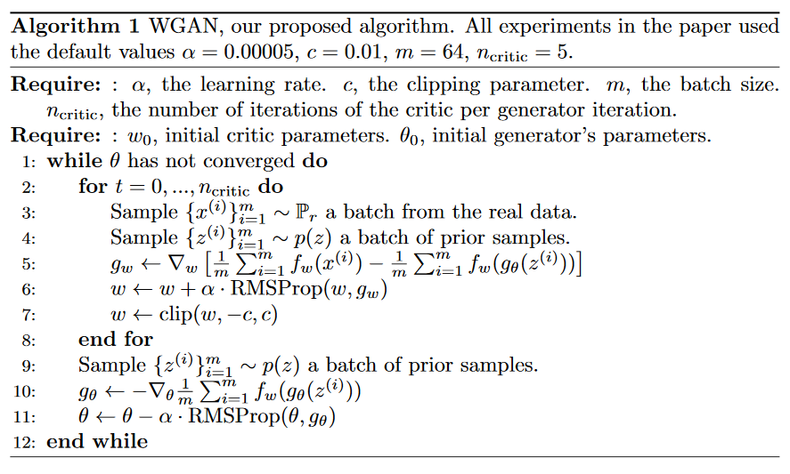
#### Results
|Real images|Generated|
| ------ | ------------|
||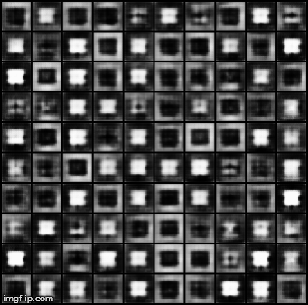|
***
***
### ACGAN: Auxiliary Classifier GANs
In ACGAN, the discriminator not only learns to distinguish fake and real images, but also tries to classify the image into correct labels. We can then manipulate the disentangled latent code and generate images conditioned on their class.

#### Structure


The class information is usually representated by a one-hot encoding. It is then concatenated with a noise vector and fed to the generator.

#### Loss design
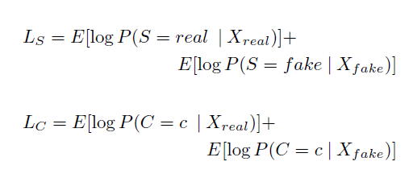

#### Results
|Fixing noise|Generated|
| ------ | ------------|
|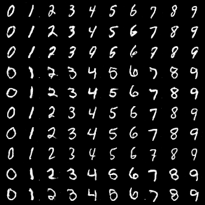|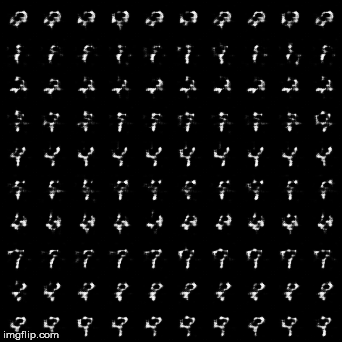|

When we fix the noise vector and only change the class label vector, ACGAN generates images from different classes but similar overall structure (eg. thickness, tilt, rotation...).